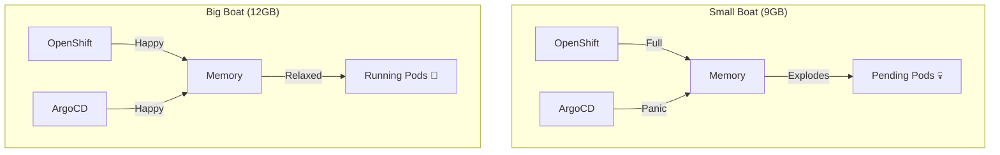
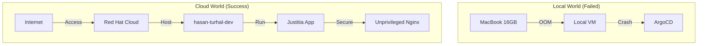

# Local OpenShift & GitOps Guide

This guide documents the setup of a professional, local GitOps environment using **OpenShift Local (CRC)**.
This mirrors the enterprise environment (Justitia 4.0) but gives you full Admin rights.

## 🗺️ The Map (Visualization)
```mermaid
graph TD
    User((User / Terminal)) --> |1. crc start| Hardware[CRC VM (The Machine)]
    User --> |2. connect| Cluster[OpenShift Cluster (The OS)]
    Cluster --> |3. install| Operator[GitOps Operator (The Installer)]
    Operator --> |4. creates| ArgoCD[ArgoCD Software (The Dashboard)]
    User --> |5. login| ArgoCD
```

## Concepts: The Toolbelt (Memorize this!)
*   **`crc` (CodeReady Containers):** The **Hardware** Manager.
    *   Think: **Power Button**.
    *   Usage: `start`, `stop`, `delete` the Virtual Machine.
*   **`oc` (OpenShift Client):** The **Software** Interface.
    *   Think: **Keyboard**.
    *   Usage: `login`, `apply`, `get pods` inside the Cluster.

## 🧬 GitOps Deep Dive: The Pizza Strategy (Base vs. Overlays)
**1. The Base (`base/deployment.yaml`)**
*   This is the **Margherita Pizza**.
*   Standard ingredients: `replicas: 1`, `image: nginx`.
*   **Rule:** Never change this directly for just one environment!

**2. The Overlay (`overlays/dev` vs `overlays/prod`)**
*   This is the **Order Slip**.
*   **DEV:** "Base + Extra Cheese" (`replicas: 2`).
*   **PROD:** "Base + Family Size" (`replicas: 10`).

**3. The Command:**
*   `oc apply -k overlays/dev` -> Builds and deploys the Small Pizza.
*   `oc apply -k overlays/prod` -> Builds and deploys the Big Pizza.

**Memorize:**
> **Base** = The Truth (One file).
> **Overlay** = The Detail (Many flavors).


## 🔑 Key Flags (Memorize this!)
*   **`-n <name>` (Namespace):**
    *   Meaning: **"In folder..."** or **"In room..."**
    *   Example: `oc get pods -n openshift-gitops` means "Show me pods *inside* the GitOps room."
    *   *Without `-n`, it looks in the `default` room.*

---

## 1. Start the Cluster
**Goal:** Start the local OpenShift Virtual Machine.
**Command:**
```bash
# Via Podman Desktop UI -> Start
# OR via CLI:
crc start
```
**Wait:** Until status is `Running`.

---

---

## 2. Configure Environment (Critical!)
**1. Explain Goal:**
We need to connect your Terminal window to the running Cluster.

**2. Explain Concept:**
`crc start` launches the server, but your Terminal doesn't know where it is yet.
`crc oc-env` prints the address. `eval` applies it to your current session.

**3. The Command:**
```bash
eval $(crc oc-env)
```

**4. Memorize:**
"**Connect the Terminal**" (You must do this in every new terminal window).

**5. Verification:**
```bash
oc whoami
# If it asks for login, connection is GOOD.
# If it says "command not found", connection is BAD.
```

---

---

## 3. Login as Admin ("God Mode")
**1. Explain Goal:**
Gain full cluster administrative rights.

**2. Explain Concept:**
To install system extensions (like ArgoCD), you need to be the "Root" user.
In OpenShift, this user is called `kubeadmin`.

**3. The Command:**
```bash
oc login -u kubeadmin -p xRnoK-JnGFC-vrrQ9-WNTfK https://api.crc.testing:6443
```

**4. Memorize:**
"**God Mode**" -> `kubeadmin`.

**5. Verification:**
It should say `Login successful` and `Using project "default"`.

---

---

## 4. Install GitOps Operator (CLI Method)
**1. Explain what we are doing:**
We are ordering the "Red Hat OpenShift GitOps" software from the catalog using a text file instead of clicking in the UI.

**2. Explain the Concept:**
In Kubernetes, you don't "install.exe". You create a **Subscription** manifest. This tells the Cluster: "Please watch the Red Hat Catalog and install/update the GitOps Operator for me automatically."

**3. The Command:**
First, we define the "Order Form" (`gitops-sub.yaml`):
```yaml
apiVersion: operators.coreos.com/v1alpha1
kind: Subscription
metadata:
  name: openshift-gitops-operator
  namespace: openshift-operators
spec:
  channel: latest
  installPlanApproval: Automatic
  name: openshift-gitops-operator
  source: redhat-operators
  sourceNamespace: openshift-marketplace
```
Then send it:
```bash
oc apply -f gitops-sub.yaml
```

**4. Step by Step:**
1.  Create the YAML file.
2.  Run `oc apply`.
3.  Check the status.

**5. Memorize:**
*   **Subscription** = The Order.
*   **CSV** (ClusterServiceVersion) = The Delivery Receipt.
*   **Red Hat Operators** = The Trusted Source.

**6. Verification:**
Check if the "Delivery" arrived:
```bash
oc get csv -n openshift-operators
```
*Look for Phase: **Succeeded**.*

### Troubleshooting: Stuck in "Pending"?
**1. Explain:** The installation is waiting. Usually because the Installer Pod isn't running yet.
**2. Concept:** Software needs a "Worker" (Pod) to install it. If the Worker is stuck (e.g., downloading), the status remains Pending.
**3. Command:**
```bash
oc get pods -n openshift-operators
```
**4. Memorize:** **Pending** usually means **Pod Problem**.

### Troubleshooting: "Connection Refused / EOF"?
**1. Explain:** The cluster is not answering. It hung up.
**2. Concept:** OpenShift Local is a virtual machine. Sometimes the network bridge breaks or the VM pauses.
**3. Command:**
```bash
crc stop
crc start
```
*Then reconnect:* `eval $(crc oc-env)` & `oc login ...`
**4. Memorize:** "Have you tried turning it off and on again?"

### Troubleshooting: "ContainerStatusUnknown"?
**1. Explain:** The lights are on, but nobody is home. The Pods are stuck in a zombie state (often happens after sleep/wake of laptop).
**2. Action:** Kill them all. Kubernetes will revive them fresh.
**3. Command:**
```bash
oc delete pods --all -n openshift-gitops
```
**4. Memorize:** **Zombie Pods** need a **Headshot** (Delete).

---

## 5. Verify ArgoCD
**Goal:** Access the ArgoCD Dashboard.
**3. The Command:**
We ask OpenShift to extract the password from the safe:
```bash
oc extract secret/openshift-gitops-cluster -n openshift-gitops --keys=admin.password --to=-
```

**4. Memorize:**
"**Namespace** `openshift-gitops` holds the **Secret**."

**5. Verification:**
It should print a long, random string (the password). **Copy it!**

---

## 6. Access the UI (ArgoCD)
**1. Explain Goal:**
Open the web interface to manage our deployments visually.

**2. Explain Concept:**
ArgoCD runs inside the cluster. We need its public address (Route).

**3. The Command:**
```bash
oc get route -n openshift-gitops openshift-gitops-server -o jsonpath='https://{.spec.host}'
```

**4. Step by Step:**
1.  Run the command to get the link.
2.  Open the link in Chrome/Safari.
3.  **Username:** `admin`
4.  **Password:** (The one you just copied).

**5. Memorize:**
**Route** = The URL/Address.

---

## 7. Deploy First App (GitOps Magic)
**1. Explain Goal:**
Tell ArgoCD to monitor our Git repository and deploy the "Justitia" app.

**2. Explain Concept:**
In GitOps, we don't manually deploy containers.
We create an **Application** manifest. This is a "Contract" that says:
*   **Source:** "Watch this GitHub Repo..."
*   **Destination:** "...and put it in this Cluster Namespace."

**3. The Command:**
Create `argocd-app.yaml` (or use your own file):
```yaml
apiVersion: argoproj.io/v1alpha1
kind: Application
metadata:
  name: justice-demo
  namespace: openshift-gitops # <--- Where ArgoCD lives
spec:
  project: default
  source:
    repoURL: https://github.com/gaip/devops-exercises.git # Your Fork
    targetRevision: justitia # Your Branch
    path: justitia-demo/overlays/dev # The Folder
  destination:
    server: https://kubernetes.default.svc
    namespace: hasan-turhal-dev # <--- Where the App goes
  syncPolicy:
    automated:
      prune: true
      selfHeal: true
    syncOptions:
    - CreateNamespace=true
```
**Apply it:**
```bash
oc apply -f justitia-demo/argocd-application.yaml
```

**4. Memorize:**
*   **Source:** Git (The Blueprint).
*   **Destination:** Cluster (The House).
*   **SyncPolicy:** Autopilot (Keep them same).

---

**5. Memorize:**
**Manual Change** = **Bad**.
**Git Change** = **Good**.

---

**5. Memorize:**
**Manual Change** = **Bad**.
**Git Change** = **Good**.

---

## 9. Strategy: Cloud vs. Local (The "Why?") 🤔
**User Question:** *"Can we not setup everything on cloud? Is that not more powerful?"*
*(Update: User has Enterprise Access / No Cost)*.

**The Answer:**
*   **Cloud (AKS/ARO/ROSA):**
    *   **Pro:** **Infinite Power** (RAM/CPU). No fan noise.
    *   **Con:** **Setup Time** (45+ mins to provision Cluster).
*   **Local (CRC):**
    *   **Pro:** **Immediate**. **Full Admin** (You break it, you fix it). **Learning** (Resource Limits).
    *   **Con:** Limited by your hardware (OOM issues).

**Decision:**
Since we are 5 minutes away from a **working local setup**, we finish this first!
**Why?** Debugging "Out of Memory" (OOM) is a critical DevOps skill. If you skip this, you miss the lesson.
*After this module, we can deploy the same GitOps repo to the Cloud!*

---

## 10. The Upgrade (Resource Crisis) 🚨
**1. Explain Goal:**
Our VM has run out of RAM! We need to make the "boat" bigger.
*Current Status: `Insufficient memory` / `Evicted`.*

**2. Explain Concept:**
*   **16GB Laptop:** You have 16GB total.
*   **9GB VM (Default):** Too small for OpenShift + ArgoCD.
*   **12GB VM (Target):** The specific size we need. (Leaves 4GB for your Mac OS).

**3. The Commands (Resize):**
We must restart the machine to upgrade hardware.
```bash
# 1. Stop the boat
crc stop

# 2. Upgrade RAM to 12GB (12288MB)
crc config set memory 12288

# 3. Start it up again
crc start
```

**4. Memorize:**
**RAM** = **Oxygen** for the Cluster.
*(No Oxygen = Zombies/Pending).*

**5. Graphic (The Crisis):**


---

## 11. The Pivot: Cloud Sandbox ☁️
**1. Explain Goal:**
Local was too slow. We switch to **Red Hat Developer Sandbox**.
*Benefit: Instant 30-Day Cluster (Free).*

**2. Explain Concept (The Hotel):**
*   **Local:** Building your own house (Takes forever).
*   **Sandbox:** Booking a Hotel Room (Instant key).
*   **Token:** Your Hotel Key card.

**3. The Process (How to get the Key):**
1.  Go to Red Hat Console -> **OpenShift Web Console** (Red Button).
2.  Top Right (Name) -> **Copy Login Command**.
3.  Click **Display Token**.
4.  Copy the line starting with `oc login ...`.

**4. The Command (Paste in Terminal):**
```bash
# Example (DO NOT COPY - Use your own!):
oc login --token=sha256~12345... --server=https://api.sandbox...
```

**5. Memorize:**
**Sandbox** = **Speed**.
**Local** = **Control**.

---

## 12. Manual Deployment (The "Old Way") 🛠️
**1. Explain Goal:**
Since ArgoCD (the Robot) wasn't home, we did the work ourselves.

**2. Explain Concept (-k vs -f):**
*   **oc apply -f file.yaml** = Apply a **File**.
*   **oc apply -k folder/** = Apply a **Kustomize Folder** (Combines many files).

**3. The Errors (Why it failed):**
*   *Error: `must build at directory ... file is not directory`*
    *   **Reason:** You tried to use `-k` on a **file**. `-k` only eats **folders**!
*   *Error: `no such file or directory`*
    *   **Reason:** You were in the wrong folder. "Relativity" matters in terminal.

**4. The Success:**
*   `deployment.apps/justice-demo configured` = First time (Created/Updated).
*   `deployment.apps/justice-demo unchanged` = Second time (Nothing changed).

**5. Memorize:**
**-k** = **Folder** (Kustomize).
**-f** = **File**.

---

## 13. The Grand Retrospective (What we learned) 🎓
**1. The Story:**
*   We started with a **Local Laptop** (16GB).
*   We built a **Virtual Machine** (CRC).
*   We installed **ArgoCD** (The Robot).
*   **The Problem:** The VM ran out of RAM (Oxygen) -> `Insufficient Memory`.
*   **The Pivot:** We moved to the **Cloud Sandbox** (Infinite Resources).
*   **The Fix:** We had to patch the App (Nginx Root) and Network (Service/Route).
*   **The Result:** A running App accessible via URL!

**2. The Final Graphic (Our Architecture):**


**3. The Golden Rules (Memorize for Exam/Job):**
1.  **GitOps:** "Git is the Source of Truth." (If it's not in Git, it doesn't exist).
2.  **Resources:** "RAM is Oxygen." (Always check requests/limits).
3.  **Security:** "Don't run as Root." (OpenShift hates Root users).
4.  **Networking:** "No Route = No Access." (Service is internal, Route is external).

**✅ MISSION ACCOMPLISHED.**

---

## 15. The Dockerfile: The Baking Recipe 🎂
**1. Explain Goal:**
Turn raw code files into a "baked" image that runs anywhere.

**2. The Analogy (Baking a Cake):**
*   **`FROM python:3.9`**: Selecting the **Kitchen** (Oven + Tools ready).
*   **`WORKDIR /app`**: Choosing the **Work Counter** (Where we mix).
*   **`COPY . .`**: Bringing the **Ingredients** (Code) to the counter.
*   **`RUN pip install`**: **Mixing** the ingredients (Installing plugins).
*   **`USER 1001`**: **Hygiene & Safety** (Washing hands, making it safe for the Cloud).
*   **`CMD ["python", "main.py"]`**: **Switching on the Oven** (Running the App).

**3. The Special Rule (OpenShift/Sandbox):**
*   In the Cloud, you are **not** allowed to be "Root" (the Chef who owns the building).
*   `USER 1001` makes you a "Guest Baker". You have restricted rights, which is **safer**.

**4. Memorize:**
> **FROM** = The Kitchen.
> **COPY** = The Ingredients.
> **USER** = The Safety.
> **CMD** = The Start.

**5. The Non-Root Permission Trick (chown/chmod):**
When the Docker image is *built*, we are Root (The Builder).
When the App *runs* in OpenShift, it is User 1001 (The Guest).
*   `chown -R 1001:0 /app`: Meaning "Give the keys to User 1001 and Group 0".
*   `chmod -R g+w /app`: Meaning "Let everyone in the group write to this folder".
*   **Why?** OpenShift uses **Random UIDs** for security. By giving access to **Group 0**, we ensure the app can write its logs/files no matter which random ID it gets.

**6. The 1001 Mystery (Who is this?):**
Computers don't care about names (like "Hasan"), they only care about **IDs (Numbers)**.
*   **UID 0:** The King (Root). Has total power. Danger!
*   **UID 1001:** The Citizen. A normal user with limited power. Safe!
*   **Memorize:** 1001 is the "Standard Citizen" in the container world.


---

## 14. The Cargo Journey: Docker vs. Kustomize 🚢
**User Question:** *"Is Docker a good idea? Do we need a Dockerfile if we use Helm/Kustomize?"*

**The Answer:** Yes, 100%. They solve different problems.

**1. The Analogy (The Global Trade):**
*   **The Goods (Code):** Your Python/Java files. (Just loose electronics on a floor).
*   **The Packing Station (Dockerfile):** The machine that puts your electronics into a **Standard Steel Container**.
*   **The Container (Docker Image):** A sealed box that looks the same to every ship.
*   **The Port Storage (Registry):** Where the container waits (GHCR.io / DockerHub).
*   **The Loading Plan (Kustomize/Helm):** A piece of paper telling the ship: *"Put 2 containers in the front, and use Port 8080."*
*   **The Cargo Ship (Kubernetes):** The massive machine that actually carries the containers and keeps them "sailing".

**2. The Logic:**
*   **Kustomize/Helm** cannot create a container. They only manage the **YAML** files (The Plan).
*   **Docker** is the only way to turn your **Code** into something Kubernetes can understand.

**3. Memorize:**
> **Docker** = **"The Packaging"** (What is inside?).
> **Kustomize** = **"The Logistics"** (Where does it go?).

---

## 16. Justitia 4.0: The Waiter & The Address Book 🍽️📔
**1. Explain Goal:**
Moving from a "Static Image" (Nginx) to "Custom Code" (Python).

**2. The Analogy (The Restaurant):**
*   **Flask (`main.py`)**: The **Waiter**.
    *   He takes orders (`@app.route("/")`).
    *   He brings back results (JSON).
*   **Users (`users.json`)**: The **Address Book**.
    *   Where the Waiter looks up information.
*   **Requirements (`requirements.txt`)**: The **Uniform/Tools**.
    *   What the Waiter needs to start working (Flask Library).

**3. Key Concepts:**
*   **`jsonify`**: Translating Python "Slang" into the international language "JSON".
*   **Port 8080**: Our "Secure Floor". We don't use Port 80 (The Ground Floor) because only Root lives there.

**4. Memorize:**
> **Flask** = The Waiter.
> **Route** = The Door.
> **JSON** = The Language.

---

## 17. GitHub Actions: The Assembly Line 🏗️🤖
**1. Explain Goal:**
Automate the "Baking" and "Shipping" of our container.

**2. The Analogy (The Car Factory):**
*   **Trigger (`on: push`)**: Someone puts a new engine on the conveyor belt.
*   **Checkout**: Picking up the parts from the warehouse.
*   **Build**: The robots (Docker) welding the car together.
*   **Push**: Driving the finished car into the **Warehouse (Registry)**.

**3. The Command Center (`.github/workflows/`):**
This is where the instructions for the robots are kept.

**4. Memorize:**
> **Actions** = The Robots.
> **Workflow** = The Instructions.
> **Registry** = The Warehouse.

---

## 18. GitHub Actions: The Workshop & The Machine 🏭💻
**1. Explain Goal:**
Defining where and how the work is actually done.

**2. The Analogy (The Car Workshop):**
*   **`jobs:`**: The **Workshop** itself. This is the container for all tasks.
*   **`build-and-push:`**: The **Abteilung** (Department). E.g., "The Painting Department".
*   **`runs-on: ubuntu-22.04`**: The **Machine/OS**. Choosing whether the work happens on a Linux, Windows, or Mac workbench.
*   **`permissions:`**: The **Access Badge**. Telling the robots they are allowed to look at the code and write to the warehouse.

**3. Key Concepts:**
*   **Pinned OS**: Using `ubuntu-22.04` ensures stability.
*   **Permissions**: Least privilege principle.

**4. Memorize:**
> **Job** = The Room.
> **Runs-on** = The Workbench.
> **Permissions** = The ID Badge.


**5. Stability vs. Speed (Why pin versions?):**
User Question: *"Should we use ubuntu-latest?"*
*   **`ubuntu-latest`**: Always gets the newest updates. Good for testing, but risky for production because an update could break your build.
*   **`ubuntu-22.04` (Pinning)**: Fixed stability. You know exactly what you get. 
*   **Memorize:** 
    *   **Latest** = Moving Target (Speed). 
    *   **Pinned** = Safe Ground (Stability).
---

## 19. GitHub Actions: Steps & Blueprints 📋🗺️
**1. Explain Goal:**
Executing the specific tasks required to build our app.

**2. The Analogy:**
*   **`steps:`**: The **Checklist**.
*   **`uses: actions/checkout@v3`**: **Picking up the Blueprints**. 
    *   The worker machine starts empty. This step copies your Git files onto the worker.

**3. Memorize:**
> **Steps** = The Checklist.
> **Checkout** = Mirroring the Code.

---

## 20. Buildx: The Universal Oven 🌪️🐳
**1. Explain Goal:**
Setting up a modern Docker "Engine" that can build faster and for different systems.

**2. The Analogy (The Multi-Tool):**
*   **`setup-docker-buildx-action`**: Setting up a **Turbo-Backofen**. 
    *   Normal Docker is like a simple oven. 
    *   **Buildx** is the modern version that can bake 5 cakes at once and works for different plates (architectures).

**3. Memorize:**
> **Buildx** = The Modern Oven.
---

## 21. GitHub Registry: The Warehouse Guard 🪪📦
**1. Explain Goal:**
Authenticating the robot so it can store the container in GitHub's storage (GHCR).

**2. The Analogy (The Security Check):**
*   **`docker/login-action`**: The **Registration Desk** at the warehouse entrance.
*   **`registry: ghcr.io`**: The **Address** of the warehouse (GitHub Container Registry).
*   **`github.actor`**: The **Driver's Name** (Automatically your GitHub username).
*   **`secrets.GITHUB_TOKEN`**: The **Digital ID Card**. 
    *   GitHub automatically gives each robot a temporary "ID Card" that only works for this specific job. This is very secure!

**3. Memorize:**
> **Login** = Authentication.
> **Registry** = The Destination (Warehouse).
> **Token** = The ID Card.

---

## 22. Build & Push: The Express Delivery 🚚🍰
**1. Explain Goal:**
Executing the final "Baking" and "Shipping" in one go.

**2. The Analogy:**
*   **`docker/build-push-action`**: The **Total Delivery Service**.
*   **`context: ./justitia-demo`**: The **Bakery Floor**.
*   **`push: true`**: The **Shipping Order**.
*   **`tags:`**: The **Label/Address** (`ghcr.io/.../justitia-dashboard:latest`).

**3. Memorize:**
> **Context** = The Source (Where?).
> **Push** = The Order (Go!).
> **Tags** = The Label (Who?).

---

## 24. Git: The Sticky Files (Cleaning the Index) 🧼🧶
**1. Explain Goal:**
Removing files that are already tracked by Git so the `.gitignore` can do its job.

**2. The Analogy (The Sticky Label):**
*   **The Problem**: Once Git has "recorded" a file in its memory (Index), the `.gitignore` is ignored for that file. It's like a person who is **already inside** the club; the "No Entry" sign outside doesn't help.
*   **The Solution**: We have to kick everyone out of the "Waiting Room" (Index) first.
*   **`git rm -r --cached .`**: This "clears" the room. No files are deleted, but Git "forgets" them for a moment.
*   **The "-f" (Force) Flag**: Sometimes Git is too cautious and blocks the cleaning. `-f` is the **Master Key** that tells Git: *"I know what I'm doing, clear the room anyway!"*
*   **`git add .`**: Now everyone walks back in THROUGH the `.gitignore` filter.


**3. Memorize:**
> **RM --cached** = Reset the Memory (Clear the waiting room).
> **Push Branch** = Send to the right destination.
---

## 25. The Warehouse Check: Inventory Verification 📋🏗️
**1. Explain Goal:**
Ensuring our "Torte" (Image) has arrived safely in the storage.

**2. The Analogy (The Inventory Check):**
*   **GitHub Actions Log**: The **Security Camera**. You check the footage to see if the robot finished the work without tripping over.
*   **GHCR.io (Packages)**: The **Warehouse Shelf**. You go to the shelf to see if the box with the "Justitia Dashboard" label is actually sitting there.

**3. Verification Steps:**
1.  **Actions Tab**: Check for the Green Checkmark ✅.
2.  **Packages**: Go to your GitHub Profile -> Packages. You should see `justitia-dashboard`.

**4. Memorize:**
> **Green ✅** = Mission Accomplished.
> **Package** = The stored product.
